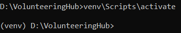

# VolunteeringHub

[](https://github.com/AlexeyVasilenkoDev/VolunteeringHub/actions/workflows/actions.yml)


This is a repository for Django-based web application, Volunteering Hub, which is a platform that connects users who
need help with volunteers who can provide assistance.

## Table of Contents:

* [Technologies](#technologies)
* [Installation](#installation)
* [Additional features](#additional-features)
* [License](#License)

## Technologies:


## Installation

To clone the repository, use the following command in your terminal:

`git clone https://github.com/OlexiyVasylenkoDev/VolunteeringHub.git`

After you cloned the repository to your local machine, navigate to the cloned directory using:
`cd VolunteeringHub`

Next, you need to create virtual environment and install all dependencies. To do it, run:

`python -m venv venv`

To activate the virtual environment run:

* On Linux: `source venv/bin/activate`
* On Windows: `venv\Scripts\activate`

If you activated the virtual environment successfully, you will see the virtual environment name in your terminal
prompt.
Just like this:



Next, you need to install the required dependencies. Run `pip install -r requirements.txt`.
If pip is not installed on your local machine, here is
the [documentation on how to install it](https://pip.pypa.io/en/stable/installation/).

Then, create a `.env` file in the project root directory with the following minimum required configurations:

```
MODE=prod
DJANGO_SETTINGS_MODULE=config.settings.${MODE}

LOCAL_PORT=8000
WSGI_PORT=8000

NGINX_HOST=foobar.com
NGINX_PORT=80
```

However, you can also add [some other features](#additional-features).

To use this project, you will need to have Docker and Docker Compose installed on your local machine. If you don't have
them installed yet, you can follow the instructions [here](https://docs.docker.com/compose/install/)!

Once you have Docker and Docker Compose installed, you can run the following command:
`docker-compose up --build`.

This will start the application and all its dependencies in Docker containers.
Once the containers are up and running, you can access the application in your web browser at `http://localhost`. That's
it! Volunteering Hub is now running on your machine.

## Additional features

* Change database to PostgreSQL:

If you prefer to use PostgreSQL as your database, you can easily switch to it by following these steps:

1. Set the following environment variables in your .env file:

```
POSTGRES_DB=*
POSTGRES_USER=*
POSTGRES_PASSWORD=*
POSTGRES_HOST=localhost
POSTGRES_PORT=5432
```

2. You also need to change DATABASES in settings. It is pretty easy, you just need to go
   to https://github.com/OlexiyVasylenkoDev/VolunteeringHub/blob/5244992e2ecbe1a14acb975fbe927f476be92591/src/config/settings/base.py#L156-L169
   , uncomment the part with PostgreSQL and comment or delete the part with SQLite.

* Add authorization with Google.

It is already configured in the application, but it doesn't work on hosting with plain HTTP and not HTTPS due
to security issues. To try it out, you need to add these lines to your `.env` file:

```
GOOGLE_OAUTH_KEY=*
GOOGLE_OAUTH_SECRET=*
```

If you are not familiar with Google OAuth - here is
an [article with a very detailed instructions](https://www.section.io/engineering-education/django-google-oauth/).

* Add Celery for generating data.

The project uses Celery to generate data..
To do it, create superuser first, by running `python src/manage.py createsuperuser`. Next, login
with credenials you provided and trigger one of the views for data generation. You can find them in the very bottom
of `volunteering/views.py`.
The other part you need to configure is to add those lines of code to your .env file.

```
CELERY_LOG_LEVEL=INFO
CELERY_NUM_WORKERS=4
```

Now you can generate data with the help of Celery!

## Usage

After starting the application, you can access it in your web browser at http://localhost.

To access all the information from the application, you need to authenticate first. You can register with either your
email or phone number. When registering, you should enter one of them in the registration page and leave the other one
blank.

After authentication, you will see `Volunteering` in the header. It is divided into two parts:

1. According to category of people:

* I need help - if you are looking for volunteers or volunteering organisations
* I can help - if you want to help and seek for needed people

2. According to category of information:

* Needs
* Opportunities
* Accounting
* Categories

You can browse the available volunteering opportunities, manage your profile, and find other relevant information on the
platform.

## License

This repository is licensed under the MIT License. See
the [LICENSE](https://github.com/OlexiyVasylenkoDev/VolunteeringHub/blob/5244992e2ecbe1a14acb975fbe927f476be92591/LICENSE)
file for more information.
